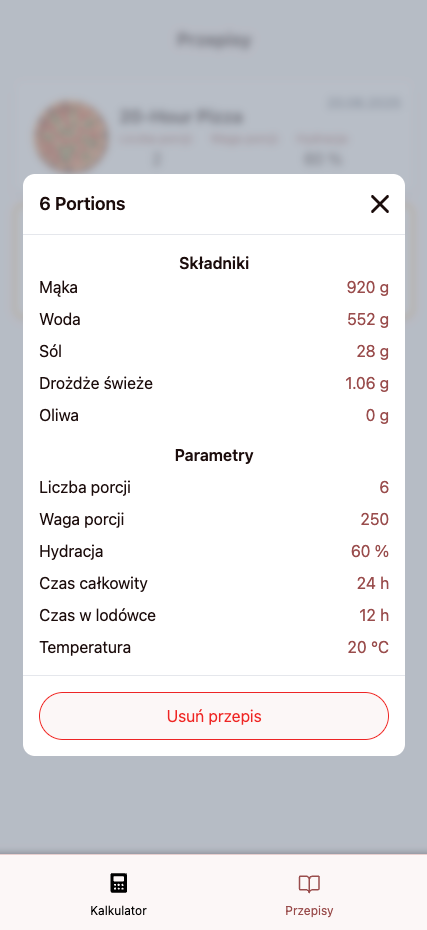

# 🍕 Pizza Dough Calculator

A mobile-friendly web app for calculating pizza dough ingredients and saving custom recipes. Built with React, supports offline use via PWA, and uses Framer Motion for smooth page transitions. Recipe data is saved in the browser via `localStorage`.

---

## Features

- **Dough Calculator**
  - Calculates flour, water, salt, oil, and yeast based on:
    - Number of portions
    - Portion weight (g)
    - Hydration (%)
    - Fermentation time (including cold retardation)
    - Temperature (°C)

- **Recipe Saving**
  - Name and save your recipes
  - View a list of saved recipes
  - Delete saved recipes

- **Progressive Web App (PWA)**
  - Works offline
  - Can be installed on mobile devices like a native app

- **Mobile-first Interface**
  - Tab navigation between calculator and recipes
  - Clean, minimalist design optimized for phones

- **Page Transitions with Framer Motion**

---

## Screenshots

### Calculator


---

### Recipes List


---

### Recipe Details



## Getting Started

```bash
git clone git@github.com:Pabiak/pizza-dough-calculator.git
cd pizza-dough-calculator
pnpm install
pnpm run dev
```